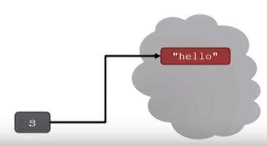
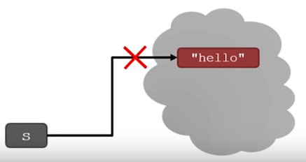
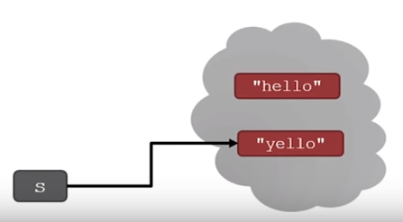

# MIT 6.0001 Introduction to Computer Science and Programming

MIT Opencourseware : 

https://ocw.mit.edu/courses/electrical-engineering-and-computer-science/6-0001-introduction-to-computer-science-and-programming-in-python-fall-2016/

Youtube : 

https://www.youtube.com/watch?v=F-_PKUUM-qY&list=PLUl4u3cNGP63WbdFxL8giv4yhgdMGaZNA&index=5

 # 3 String Manipulation, Guess and Check, Approximations, Bisection

###  Strings

- think of as a sequence of case sensitive characters
- can compare string with == , > , < etc.
- len() : get the length of the string in the () 

``` py
s = 'abc'
l = len(s)  # l = 3
```


### Strings `index`

- can use indexing to get the value at a certain index or position 
- generally index starts with 0 
- if you use negative number last element always positioned at -1
- if use the index more than the length, then python returns you out of the range error

``` python
s[0] # a
s[1] # b
s[2] # c
s[-1] # c
s[-2] # b
s[-3] # a
s[20] # error!!!
```


### Strings `slicing`

- can slice strings using [start, stop, step]
- contain string[start]~ string[stop-1]
- use 2 number (not step) then step value is 1 by default
- can omit numbers and leave just colons

``` python
s = 'abcdefgh'
#idx 01234567
s[3:6] # 'def'
s[3:6:2] #'df' 
s[::] # s[0:len(s):1] : 'abcdefgh'
S[::-1] # s[-1:-(len(s)+1):-1] : 'hgfedbca'
s[4:1:-2] # 'ec'
```


### String `immutable`

- strings are "immutable"  that means cannot be modified

``` python
s = 'hello'
s[0] ='y' # error occurs , not allowed
s = 'y' + s[1:len(s)] # is allowed, the variable s bound to new object 
                      # s = 'yello'
```

|                                                              |                                                              |                                                              |
| ------------------------------------------------------------ | ------------------------------------------------------------ | ------------------------------------------------------------ |
|  |  |  |


### String and Loops

- for loop can iterate not only numbers but other things include string
- these two code snippets do the same thing
- bottom one is more "pythonic"

``` python
s= 'abcdefgh'
for index in range(len(s)):
    if s[index] == 'i' or s[index] =='u':
        print('There is an i or u')
        
for char in s:
    if char == 'i' or char =='u':
        print('There is an i or u')
```


## Algorithms

### Guess-and-Check

``` python
cube = 8
for guess in range(abs(cube)+1):
    if guess**3 == abs(cube):
        break
if guess**3 != abs(cube):
    print(cube, 'is not a perfect cube')
else:
    if cube < 0:
        guess = -guess
    print('Cube root of'+str(cube)+' is '+str(guess))
```

- also called `exhaustive enumeration`
- be able to check if your solution is correct
- until find the solution guess another value
- once find the value then no more iteration needs. so break the loop


### Approximate Solutions

- good enough solution
- start with a guess and increment by some small value
- keep guessing  if |guess^3-cube| >= epsilon for some small epsilon

- decreasing increment size -> slower program
- increasing epsilon -> less accurate answer

``` python
cube = 27
cube = 10000
epsilon = 0.01 
guess = 0.0 
increment = 0.0001
num_guesses = 0
while abs(guess**3-cube) >= epsilon and guess <= cube:
    guess += increment
    num_guesses += 1
print('num_guesses =', num_guesses)
if abs(guess**3 - cube) >= epsilon:
    print('Failed on cube root of',cube)
else:
    print(guess,'is close to the cube root of',cube)
```

- sometimes cannot find the solution and do infinite loop


### Bisection Search

- half interval each iteration
- new guess is halfway in between

```python
cube = 27
epsilon = 0.01 
num_guesses = 0
high = cube
guess = (high + low) / 2.0
while abs(guess**3-cube) >= epsilon:
    if guess**3 < cube:
        low = guess
    else:
        high = guess
    guess = (high + low) / 2.0
    num_guesses += 1
print('num_guesses =', num_guesses)
print(guess,'is close to the cube root of',cube)
```


### Bisection Search Convergence

- search space
  - first guess : N/2
  - second guess : N/4
  - kth guess : N/2^k
- guess converges on the order of log2N steps
- bisection search works when value of function varies monotonically with input


